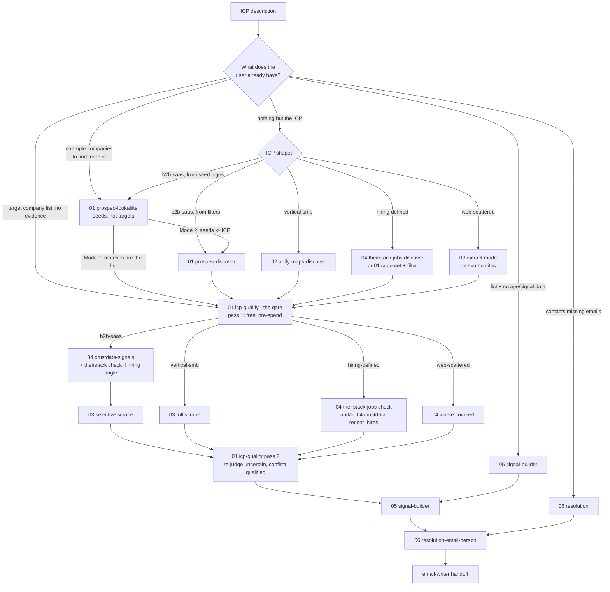

# The chain decision tree

How the router picks a chain: the ICP's shape picks the discovery path, volume picks the
extraction depth, the evidence type picks the signal source, every discovered list passes
the qualification gate (01-icp-qualify) before credits touch it, and everything passes
through judgment (05) before anything gets written or sent. Two model-judgment layers
bracket the paid steps: the gate decides who is worth paying to know more about, the judge
decides what to say to them. This doc is the routing logic as a readable reference - the
skill executes it, but you can follow it by hand.

## Entry points: start where the data runs out

Discovery is step one only when the user has nothing. Route to the first step whose input
is missing:

| Already in hand | Enter at | Why |
|---|---|---|
| Nothing but an ICP description | 01-prospeo-discover, 02, or 04-theirstack discover (by shape) | The list has to exist first |
| Example companies to find more of | 01-prospeo-lookalike | The list is seeds to expand, not targets to enrich |
| Target domains, no evidence | 01-icp-qualify, then 03/04 on survivors | The gate is free; evidence spend goes only to companies that could buy |
| Domains + scrape or signal data | 05 | The evidence exists; it needs ranking |
| Named people, no emails | 06 | Only resolution is missing |
| Signals + verified emails | email-writer | The chain is done |

**A bare domain list is the one genuinely ambiguous input.** It routes two opposite ways
depending on what it *is*: a target list gets enriched (03/04), a seed list gets expanded
(01-prospeo-lookalike). Closed-won accounts, a customer roster, or a competitor's logos are
seeds; a conference export or a purchased list is targets. The tell is in how the client
frames it ("find more like these" vs "here's who we want to reach"); when it's unclear, ask,
because scraping a seed list researches customers the client already has.

Records are additive down the chain (see `_shared/CONVENTIONS.md`): every step keeps the
upstream fields and adds its own, keyed by normalized `domain`. Entering mid-chain never
requires reformatting what the user already has - only filling what's absent.

## The four ICP shapes

**b2b-saas** - companies a structured B2B database can filter: industry + headcount + geo +
funding, buyers with job titles. Test: "could I find these in a company database by
firmographics?" If yes, discovery is 01. Which 01 depends on what the client can articulate:
a described ICP goes to 01-prospeo-discover (filters in, list out); example logos go to
01-prospeo-lookalike (seeds in, similar companies out). Lookalike is the better door when
the client's pattern is tacit - they recognize a good-fit account but can't name the
filters. Its Mode 2 reads the closest matches for their shared pattern, builds an ICP, and
hands that to discover for the broad search, so the two compose rather than compete.

**vertical-smb** - local or owner-operated businesses: studios, salons, clinics, gyms,
restaurants, trades, venues. Test: "would I find these on Google Maps?" If yes, discovery
is 02-apify-maps-discover. Title databases barely cover these companies; Maps is the
database.

**hiring-defined** - the ICP is an event, not a category: "companies that just hired a
RevOps lead", "teams with an open SDR req". Route by evidence type. Open reqs:
04-theirstack-jobs discover mode searches "companies with an open X req" directly - the
free blurred count returns job and company yield before any spend, so no superset is
needed. Past joins: nothing searches that directly, so build a bounded firmographic list
with 01 first, then keep only companies with hiring evidence (open postings via
04-theirstack-jobs check mode, or recent joins via 04-crustdata's `recent_hires`). The
superset must be capped in the plan - enriching an unbounded superset is the dominant
cost in this shape.

**web-scattered** - no database covers them and they're not Maps businesses: companies
that exist mainly as listings on directories, marketplaces, or niche community sites.
Discovery is 03's extract mode pointed at the 2-5 source sites where the ICP lives; the
extracted list then flows through the normal chain.

Ambiguous shape: ask one question ("database-addressable, Maps-local, or defined by
something that just happened?"), commit, and label the assumption. One answer plus labeled
assumptions beats a five-question interview.

## The qualification gate (01-icp-qualify)

Discovery filters match **labels** - industry codes, size bands, locations as a database
recorded them. The gate judges **fit**: would this specific company plausibly buy from
this specific client? Acquired companies, competitors, shells, and stale records all pass
label filters and then waste enrichment spend; the gate exists so every credit spent after
discovery goes to a company that could actually buy.

What the router needs to know about it:

- **It's free and always on** - in-session judgment, no API key. It sits between discovery
  (or an imported target list) and the first credit-spending step in every chain.
- **It runs twice.** Pass 1 judges discovery fields pre-spend; pass 2 re-judges the
  `uncertain` rows and re-confirms the qualified ones after 03/04 add evidence, before 05
  ranks anything.
- **Three verdicts, asymmetric on purpose**: disqualification needs quotable evidence;
  uncertainty is never a disqualification (a wrongly dropped buyer costs more than a few
  wasted credits). Disqualified rows leave `records.jsonl` physically, with the audit
  trail in `disqualified.jsonl` - downstream skills need no changes.
- **The plan feeds it**: client profile (icp_context), exclusion list, and the
  per-company downstream cost from `unit-costs.md`, so its "spend avoided" summary line
  is a real number.
- **A low pass rate is a discovery problem.** If the gate guts a list, tighten the
  discovery filters and re-pull - don't loosen the gate to keep volume up.

## Default chains and the calls behind them

| Shape | Chain |
|---|---|
| b2b-saas | 01 (discover from filters / lookalike from seeds) -> 01-icp-qualify -> 04-crustdata -> 03 (selective) -> 05 `icp_shape=b2b-saas` -> 06 |
| vertical-smb | 02 -> 01-icp-qualify -> 03 -> 05 `icp_shape=vertical-smb` -> 06 |
| hiring-defined | 04-theirstack-jobs discover, or 01 (bounded) -> 01-icp-qualify -> 04-theirstack-jobs / 04-crustdata -> 05 `b2b-saas` -> 06 |
| web-scattered | 03 extract -> 01-icp-qualify -> 04 where covered -> 05 -> 06 |

The non-obvious calls:

- **01 is a layer, not one skill.** 01-prospeo-discover builds a list from firmographic
  filters; 01-prospeo-lookalike builds one from seed companies. Discover for a described
  ICP, lookalike for example logos - and lookalike when the pattern is tacit, since its
  Mode 2 distils an ICP from the closest matches and hands it back to discover. One
  planning caution: niche seeds often sit under a giant parent industry, so a Mode 2 ICP
  of industry + size + geo alone can balloon into six figures. The specificity lived in
  the keywords - re-add the recurring one and sanity-check the count before export.
- **04 is a layer, not one skill.** 04-crustdata-signals covers what already happened
  (funding, joins, headcount); 04-theirstack-jobs covers what's open right now (job
  reqs). Both write the same additive records and 05 merges by domain, so run both when
  the play needs both kinds of evidence. The theirstack sizing count (~1 credit against
  a whole domain list) prices the open-req overlay before committing to it.
- **b2b-saas scrapes selectively.** 04-crustdata's structured signals cover
  database-tracked companies well, so 03 runs only on the slice that needs page-level
  evidence: the top decile by signal strength, or accounts where 04 came back empty.
  Scraping all of a 2,000-domain list spends credits on companies judgment will score
  3/10 anyway.
- **vertical-smb skips 04-crustdata and must scrape.** Funding and headcount vendors
  barely cover owner-operated businesses. The website plus the Maps listing is the
  evidence, so 03 is not optional here - it's most of the input 05 will get. When the
  client's angle is hiring, a 04-theirstack sizing count is the cheap test of whether
  postings coverage exists before assuming it doesn't.
- **hiring-defined runs the cheaper filter first.** Between open postings
  (04-theirstack-jobs, near-free sizing counts then 1 credit/job) and recent joins
  (04-crustdata, ~2.6 credits/domain), run whichever is cheaper for the volume before
  enriching anything else, and only carry forward companies that pass. The theirstack
  sizing count costs ~1 credit against a domain list (free without one) - it almost
  always goes first.
- **web-scattered starts from source URLs, not queries.** Ask the user for the directories
  or listing sites; don't guess them. The extract schema should capture whatever the
  listing exposes (name, site, location, category) so the record enters the chain with
  fields already filled.
- **Judge before you resolve - by default.** Judgment (05) decides which accounts deserve
  per-contact resolution spend, and the signal work is what makes the email worth sending.
  The defensible inversion - resolve first, enrich only the emailable set - wins when the
  client will email every resolvable account regardless of angle, or when per-domain
  signal spend clearly exceeds per-contact resolution spend at expected coverage. Pick one
  and say why in the plan.
- **Free gates shrink paid steps.** 01-icp-qualify is the institutional one - always on,
  right after discovery. Beyond it, look for any other free call that disqualifies domains
  before a paid pass: a free employee scan showing who even has the target function, a
  count-only size check, a cached prior run. Halving a per-domain credit step beats
  optimizing anything downstream of it.

## The resolution waterfall (06)

One principle governs resolution: **bounce rate, not find rate, is the number that
matters.** A found-but-undeliverable email burns sender reputation, which is worth more
than any single contact. The waterfall is ordered by cost, and every found email is
validated before it counts:

1. **Prospeo** - title-first search. Misses are free, so title variants are cheap to try.
   Preview counts before revealing anything.
2. **Blitz** - domain-first. Resolves the person and LinkedIn when title search misses;
   email resolved separately.
3. **Findymail** - name+domain email finder, pay-per-valid. Skipped with a warning if no
   key is set.
4. **ZeroBounce** - independent validation on every found email. Catch-all verdicts
   are kept but flagged; hard invalids trigger a provider retry only if the user opted in.

Broadening a title search never crosses seniority bands (a Director is not a CTO), and no
generic `info@` addresses are ever invented. The full mechanics live in
`06-resolution-email-person/SKILL.md`.

## Modifiers

Applied in this order, after the shape picks the chain:

1. **Volume** sets extraction depth: under ~200 domains, standard scrape; 200-2K, standard
   on the signal-bearing slice and minimal elsewhere; over 2K, minimal or top-decile-only.
   Deep mode is for short high-value lists.
2. **Budget** caps volume: max affordable records = ceiling / unit cost (see
   `unit-costs.md`). If the target volume doesn't fit the ceiling, say so in the plan
   rather than quietly shrinking a step.
3. **Urgency** trades depth for speed: minimal scrape, default enrichment windows, no
   nice-to-have overlays. It never skips 05 - an unjudged list produces the generic copy
   this chain exists to avoid.

**Pilot first, always.** 100-200 records end-to-end before full volume. The pilot
validates per-unit cost, the qualification pass rate, hit rate, and signal quality while
the budget is still intact - and it carries the gate's calibration rounds, so the full
run inherits an already-corrected qualification brief.

## Worked examples

**"Pilates and yoga studios in the Toronto area" (vertical-smb).**
02 pulls ~500 Maps records with rating and review counts. 01-icp-qualify screens the pull
before anything is scraped - franchise locations, gyms mislabeled as studios, closed
holdouts, rows whose homepage title/meta (fetched free) says "physio clinic" - so 03 only
spends on plausible buyers. 03 scrapes the survivors in minimal mode (most are 3-5 pages
anyway). 05 judges with `icp_shape=vertical-smb` - class schedule sprawl, hiring for front
desk, aging booking widget. 06 resolves the owner or studio manager, mostly via the
domain-first rung. No 04: funding databases have nothing on owner-operated studios.

**"Series A/B vertical SaaS in North America selling to restaurants" (b2b-saas).**
01-prospeo-discover builds the TAM (industry + funding stage + geo + headcount).
01-icp-qualify gates it before enrichment - the agencies, POS resellers, and acquired
brands that matched the industry labels never reach 04, and each one dropped saves ~2.6
CrustData credits plus everything downstream. 04 enriches the qualified set with funding
recency, headcount trend, and recent hires. 03 scrapes only the top slice 04 surfaced. 05
judges with `icp_shape=b2b-saas`. 06 resolves the VP Sales or Head of Growth title-first.
The gate plus the selective scrape are the cost levers: 2,000 discovered, ~1,600 enriched,
maybe 200 scraped.

**"We closed these 30 accounts - find us more like them" (b2b-saas, seed-based).**
The 30 logos are seeds, not targets, so discovery is 01-prospeo-lookalike, not 03. Resolve
the seeds to company IDs, run the lookalike at tier T2, and read the count. If the client
just wants the similar-company list, that's Mode 1 - the matches export straight into the
chain. If the pattern is worth generalizing, Mode 2 distils an ICP from the 25 closest
matches and hands it to 01-prospeo-discover for a broader pull - watch for parent-industry
overshoot and re-add the recurring keyword if the count balloons. Either way the output
enters the gate, then 04 -> 03 (selective) -> 05 -> 06 exactly like a discover-built list;
only the front door differs.

**"Companies that just hired a RevOps leader" (hiring-defined).**
04-theirstack-jobs discover checks open RevOps reqs directly (free count first); 01 builds
a bounded superset only if the play also needs already-filled hires, which
04-crustdata's `recent_hires` catches. Only
companies with evidence survive into 05, which scores freshness - a 30-day-old hire beats
a 300-day-old one. 06 resolves the new leader by name where 04 returned it.

**"Independent bike shops that sell on marketplace sites" (web-scattered).**
No database category, weak Maps coverage for the online-first ones. 03's extract mode runs
on the 2-3 marketplace directories where they list, pulling name, site, and location into
records. 01-icp-qualify gates the extracted list - directory listings are the noisiest
discovery source (dead shops, distributors, hobby pages), so the free gate earns the most
here. 04-crustdata adds nothing (not DB-tracked), so the qualified set goes straight to a
full 03 scrape of each shop's own site, then 05 and 06 as usual.
