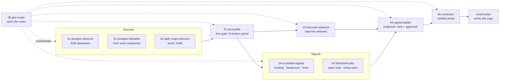

# Headless GTM

GTM without the SaaS layer. An outbound pipeline built as agent skills for [Claude Code](https://docs.anthropic.com/en/docs/claude-code/skills) and [Codex](https://learn.chatgpt.com/docs/build-skills): describe an ICP in plain English and the chain takes it from company discovery to verified, signal-ranked contacts - every step running on raw vendor APIs, not browser tabs, with cost approved before any credit is spent.

This is the discovery-to-resolution chain [Zevenue](https://zevenue.com) runs on client work, published as installable skills. No orchestration platform, no per-seat tools. The coding agent is the operator, the vendor APIs are the backend, and the skills encode the methodology.

## The chain

| # | Skill | Wraps | Job (in -> out) |
|---|---|---|---|
| 00 | [`00-gtm-router`](skills/00-gtm-router/) | the other nine | ICP + budget + volume -> the right chain, with per-step cost estimates, then supervised execution. |
| 01 | [`01-prospeo-discover`](skills/01-prospeo-discover/) | Prospeo | Plain-English ICP -> firmographic company list. TAM sizing, 33 filters. |
| 01 | [`01-prospeo-lookalike`](skills/01-prospeo-lookalike/) | Prospeo | Seed companies -> ranked lookalikes, or a pattern-built ICP handed back to discover for the broad search. |
| 01 | [`01-icp-qualify`](skills/01-icp-qualify/) | model judgment (no API) | Discovered companies -> the ones that could plausibly buy. The free gate that runs before any credit is spent. |
| 02 | [`02-apify-maps-discover`](skills/02-apify-maps-discover/) | Apify (Compass actor) | Vertical + geo -> local-business prospect list from Google Maps, normalized records. |
| 03 | [`03-firecrawl-research`](skills/03-firecrawl-research/) | Firecrawl | Domain -> clean, page-typed markdown (homepage, about, careers, pricing...) or structured JSON. |
| 04 | [`04-crustdata-signals`](skills/04-crustdata-signals/) | CrustData | Domains -> funding rounds, headcount growth, department growth, recent hires. |
| 04 | [`04-theirstack-jobs`](skills/04-theirstack-jobs/) | TheirStack | Domains -> open reqs, titles, seniority, hiring team. Also searches "companies hiring X right now" directly. |
| 05 | [`05-signal-builder`](skills/05-signal-builder/) | model judgment (no API) | Scraped pages + structured signals -> ranked signals with verbatim provenance, 1-10 scores, and a campaign approach per signal. |
| 06 | [`06-resolution-email-person`](skills/06-resolution-email-person/) | AI Ark -> Prospeo -> Blitz -> Findymail + ZeroBounce | Domain (+ optional name or title) -> verified, send-safe email. Waterfall by cost, validate everything. |

Prefixes are folder names, not a strict run order. The gate (`01-icp-qualify`) is numbered with discovery but runs *after* it, and `04-theirstack-jobs` doubles as the discovery route when the ICP is itself a hiring event.



Start anywhere: the router enters the chain at the first step whose input is missing. Already have a domain list? Gate it, then start at 03/04. Have example companies instead of a described ICP? Start at lookalike - that list is seeds, not targets. Have contacts without emails? Start at 06. Hiring-defined ICPs ("companies with an open SDR req") skip firmographic discovery entirely and enter at `04-theirstack-jobs` in discover mode, whose sizing count is free.

## Why a chain, not a tool pile

Most GTM tooling advice stops at "use Firecrawl for scraping." The hard part is everything between the tools:

- **A shared record contract.** Every skill reads and writes the same JSONL records, keyed by normalized domain. Each step adds fields and never overwrites upstream ones, so any skill's output is any later skill's input, and an interrupted run resumes without re-spending. See [`_shared/CONVENTIONS.md`](skills/_shared/CONVENTIONS.md).
- **Two free judgment layers bracket the paid steps.** The gate (01) decides who is worth paying to know more about; the judge (05) decides what to say to them. Neither costs a credit, and both exist because vendors sell labels while campaigns run on fit. The gate runs twice - once on discovery fields, again after 03/04 add evidence, where it can demote a company it previously passed.
- **Judgment as its own step.** Vendors sell facts ("raised a Series A", "hired 18 people", "has an open VP Sales req"). Whether a fact is an outreach angle for *this* offer is a judgment call, so it gets its own layer (05) with provenance rules: every signal carries the verbatim sentence and source that back it.
- **Signals are a layer, not a skill.** 04-crustdata covers what already happened - funding, joins, headcount. 04-theirstack covers what's open right now. Both write the same additive records and 05 merges them by domain, so a chain runs either or both depending on which kind of evidence the play needs.
- **Spend gates everywhere.** Credits are money. Every skill estimates cost before calling anything, confirms before large runs, caches results, and resumes interrupted batches without re-spending.
- **Deliverability over find rate.** Resolution (06) optimizes bounce rate, not found-email count. Cheapest resolver first, independent validation on every hit, seniority bands never crossed when a title search broadens, and no invented `info@` addresses.
- **Methodology routing.** The router (00) encodes the decision tree - which ICP shapes go through which chain, at what depth, and what it should cost - so the reasoning is inspectable, not tribal. Read it as prose in [`decision-tree.md`](skills/00-gtm-router/references/decision-tree.md).

In our internal benchmark (4 scenarios, 27 assertions), chains run through the router scored 100% with zero variance vs 84% (±19) for the same setup without it, at equal time and token cost. The edge isn't tool knowledge - it's the enforced operating contract.

## The writing layer

Where the chain hands off. Optional, but the chain's output is shaped to feed it:

| Skill | What it does |
|---|---|
| [`email-writer`](skills/email-writer/) | 3-email cold sequences using the Situation -> Insight -> Inquisition methodology, with deliverability rules and a QA checklist. |
| [`creative-variable`](skills/creative-variable/) | Specs the personalization variables for a campaign - names, grammar, sources, extraction prompts, fallbacks. |
| [`prospect-posts`](skills/prospect-posts/) | Scans prospects' recent LinkedIn posts for a theme. Account intelligence input. |
| [`gtm-context`](skills/gtm-context/) | Persists your offer + ICP as context files, so the router and the gate don't re-interview you every run. Run once per workspace if you're using the writing skills. |

## Install

Works in **Claude Code** and **Codex** - the skills follow the [agent skills standard](https://agentskills.io) (`SKILL.md` + frontmatter), and every script is plain Python on env-var keys.

```bash
git clone https://github.com/Zevenue/headless-gtm.git
cd headless-gtm
```

Skills live in the tool-neutral top-level `skills/` directory, one folder per skill - the same layout as [anthropics/skills](https://github.com/anthropics/skills).

- **CLI installer** (easiest): `npx skills add Zevenue/headless-gtm` - detects your agent and installs to the right place.
- **Claude Code**: copy `skills/*` into `~/.claude/skills/` (every session) or your project's `.claude/skills/`.
- **Codex**: copy `skills/*` into `~/.agents/skills/` or your project's `.agents/skills/`.
- **Or just run from the repo**: `claude` or `codex` started in this directory finds the skills directly (`.claude/skills` and `.agents/skills` are symlinks to `skills/`).

Then:

```bash
cp .env.example .env
pip install -r requirements.txt
```

Python 3.10+. Every key is optional: each skill uses only the keys it needs and logs what it skips. The router (00), the gate (01-icp-qualify), the judge (05), and the writing skills need no keys at all. `.env.example` documents every variable and where to get each key. If you copy skills individually, bring `skills/_shared/` along - the chain skills read the record contract and helper modules from it. If you use the writing skills, also copy `context/` into your project root.

## Use

Describe what you want and the right skill triggers - or invoke by name:

```
new client ICP: B2B SaaS, US, 50-500 headcount, budget $200     -> 00-gtm-router plans the chain
qualify this list against the ICP before we enrich it           -> 01-icp-qualify
laundromats in Texas metros                                     -> 02-apify-maps-discover
rank these accounts - who do we email first, with what angle    -> 05-signal-builder
find the owner's email for these 40 domains                     -> 06-resolution-email-person
```

Each skill's `SKILL.md` is the authoritative spec for what it expects and returns.

## v2.0

This repo was previously `Zevenue/gtm-skills` (v1: the methodology skills only). v2.0 renames it to Headless GTM, adds the numbered API chain, and makes everything run in both Claude Code and Codex:

- New: the ten chain skills above, plus the shared record contract in `_shared/`
- Replaced: `signal-builder` -> `05-signal-builder` (chain-native), `job-search` -> `04-theirstack-jobs` (free sizing counts, discover mode, credit caching)
- Kept: `gtm-context`, `email-writer`, `creative-variable`, `prospect-posts`

Old links redirect. Evals for every skill are maintained in Zevenue's private source repo and run before each release.

## License

MIT. See [LICENSE](LICENSE).

## About Zevenue

[Zevenue](https://zevenue.com) is a Toronto-based GTM engineering firm. We build custom outbound + RevOps systems for GTM teams. Reach me at: yusuf@zevenue.com
